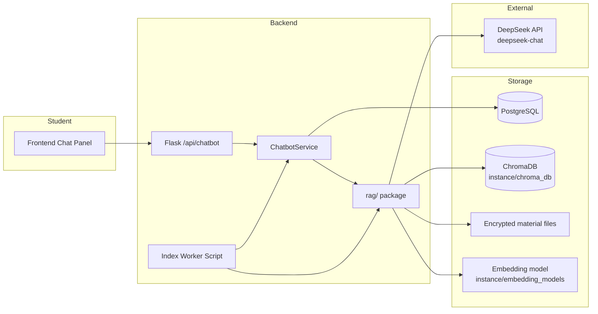

# JustClick AI Chatbot — Team Guide

This document explains what we built, the main technologies, how indexing works, and how to set up and run the chatbot locally.

---

## 1. What we built

JustClick AI is a **material-scoped academic assistant**. A student opens a course material (PDF, PPTX, PPT, DOCX) and asks questions about **that file only**.

The system does **not** answer from general internet knowledge. It:

1. **Indexes** each material (extract text → split into chunks → embed → store in a vector database).
2. **Retrieves** the most relevant chunks when the student asks a question.
3. **Generates** an answer using **DeepSeek** with strict prompts (“answer only from provided context”).

Supported student actions:

| Mode | Example question | Retrieval strategy |
|------|------------------|-------------------|
| **Chat** | “Explain polymorphism in this chapter” | Semantic search (top similar chunks) |
| **Summary** | “Summarize this material” | First N chunks in document order |
| **Quiz** | “Make a quiz” | First N chunks in document order |
| **Q&A** | “Generate Q&A” | First N chunks in document order |

---

## 2. Architecture (high level)



**Two-model design:**

| Role | Model | Where it runs |
|------|--------|----------------|
| **Embeddings** (search) | `BAAI/bge-small-en-v1.5` | Local CPU on our server |
| **Answer generation** (LLM) | `deepseek-chat` | DeepSeek cloud API |

We use a local embedding model so indexing and search do not send full documents to the LLM provider. Only retrieved text snippets go to DeepSeek.

---

## 3. Core terminology

### RAG (Retrieval-Augmented Generation)

Pattern: **retrieve relevant document pieces first**, then ask the LLM to answer using only those pieces. Reduces hallucination and keeps answers tied to course materials.

### Chunk

A small piece of text cut from a material file (default ~400 characters with 80-character overlap). Long PDFs/slides become hundreds of chunks. Each chunk is stored with metadata (`material_id`, `chunk_index`, `chapter_label`, etc.).

### Embedding / vector

A list of numbers (e.g. 384 dimensions) that represents the **meaning** of a text. Similar meanings → similar vectors. We use embeddings to find chunks related to a student’s question without keyword matching only.

**Library:** `sentence-transformers`  
**Model:** `BAAI/bge-small-en-v1.5` (normalized vectors, cosine similarity)

### Vector database (ChromaDB)

Stores chunks + embeddings on disk at:

```
backend/instance/chroma_db/
```

Collection name (config): `cmcp_material_chunks_v3`  
Distance metric: **cosine** (matches normalized embeddings).

### Index / indexing

**Indexing** = preparing a material for AI:

1. Read file (decrypt if `.enc`)
2. Extract text (PDF / PPTX / legacy PPT / DOCX)
3. Split into chunks
4. Embed each chunk locally
5. Save vectors + text into Chroma
6. Record status in PostgreSQL (`chatbot_material_indexes`)

Until a material is **indexed**, students see “AI is preparing this material.”

### Index worker

Background process (`scripts/chatbot_index_worker.py`) that picks **pending jobs** from `chatbot_index_jobs`, processes one material at a time, and updates status. Queuing jobs alone does nothing—the worker must be running.

---

## 4. Models we use

### DeepSeek (LLM — answer generation)

| Setting | Default |
|---------|---------|
| API | `https://api.deepseek.com` |
| Model | `deepseek-chat` |
| Env | `DEEPSEEK_API_KEY` |

Used only in `rag/answer.py` via OpenAI-compatible client. Prompts enforce: answer from context only, cite material, structured output for summary/quiz/Q&A.

### BGE-small (embeddings — search)

| Setting | Default |
|---------|---------|
| Model | `BAAI/bge-small-en-v1.5` |
| Provider | `local_sentence_transformers` |
| Device | `cpu` (`CHATBOT_EMBEDDING_DEVICE`) |
| Cache | `backend/instance/embedding_models/BAAI--bge-small-en-v1.5` |

Download once with `scripts/download_embedding_model.py`. Runtime download is disabled by default (`CHATBOT_ALLOW_RUNTIME_MODEL_DOWNLOAD=false`).

**GPU is not required.** CPU is enough for development and moderate load.

---

## 5. Database tables

All chatbot tables are multi-tenant (`company_id`).

### `chatbot_material_indexes`

One row per material per company. Tracks indexing state.

| Important columns | Purpose |
|-------------------|---------|
| `material_id` | Which material |
| `file_hash` | Skip re-index if file unchanged |
| `chunk_count` | How many chunks in Chroma |
| `index_status` | `pending`, `indexing`, `indexed`, `failed`, `stale` |
| `indexed_at`, `last_error` | Success time / failure reason |
| `embedding_model`, `chunk_size`, `chunk_overlap` | Settings used when indexed |

### `chatbot_index_jobs`

Background job queue for the worker.

| Important columns | Purpose |
|-------------------|---------|
| `material_id` | Material to index |
| `trigger_type` | e.g. `manual_reindex`, `bulk_reindex`, `index_missing` |
| `status` | `pending`, `processing`, `completed`, `failed` |
| `attempt_count`, `error_message` | Retry / debugging |

Duplicate pending jobs for the same material are prevented in `jobs.py`.

### `chatbot_sessions`

A chat conversation. Material-scoped sessions store `material_id`, academic context IDs, and `context_json` for the UI.

### `chatbot_messages`

User and assistant messages per session (`role_name`: `user` / `assistant`).

---

## 6. Backend code layout

```
backend/
├── CHATBOT.md                          ← this file
├── instance/
│   ├── chroma_db/                      ← vector store (gitignored)
│   └── embedding_models/               ← local embedding model (gitignored)
├── scripts/
│   ├── download_embedding_model.py
│   ├── chatbot_index_worker.py
│   ├── reindex_existing_materials.py
│   ├── reset_failed_index_jobs.py
│   └── diagnose_chatbot_index.py
└── src/cmcp/modules/chatbot/
    ├── models.py                       ← SQLAlchemy models
    ├── service.py                      ← business logic, ask, index status
    ├── jobs.py                         ← schedule index jobs
    ├── api → chatbot_api.py            ← REST routes
    └── rag/
        ├── extractor.py                ← read PDF/PPT/PPTX, extract text
        ├── chunker.py                  ← split text
        ├── embeddings.py               ← local sentence-transformers
        ├── vector_store.py           ← Chroma read/write
        ├── retriever.py              ← semantic + full-material retrieval
        ├── indexer.py                ← index_material()
        ├── answer.py                 ← DeepSeek calls + modes
        ├── modes.py                  ← detect summary/quiz/qna/chat
        └── warmup.py                 ← preload models on app start
```

---

## 7. Indexing logic (who triggers what)

| Event | Who schedules a job | `force` re-index? |
|-------|---------------------|-------------------|
| Admin uploads/updates material | Materials service | No |
| Admin manual re-index | API `/admin/reindex/...` | Yes (`manual_reindex`) |
| Bulk re-index script | `reindex_existing_materials.py` | Yes (`bulk_reindex`) |
| First-time missing index (student opens panel) | `get_index_status` only if **no index row** | No |
| Student ask | Never indexes | — |

**Worker flow:**

1. Claim one `pending` job → mark `processing` → commit DB.
2. Run `index_material()` **outside** long transaction (read file, embed, write Chroma).
3. Mark job `completed` or `failed` → commit DB.

If file hash + embedding settings unchanged and `force=False`, indexing is **skipped** (fast).

**Indexable material types:** `pdf`, `slides`, `doc` with a file URL and `is_enabled=true`.

---

## 8. Ask / chat flow

1. Student opens material → `GET /api/chatbot/index-status/{material_id}`.
2. Frontend creates session → `POST /api/chatbot/sessions` with `material_id`.
3. Student asks → `POST /api/chatbot/ask` with `session_id` + `question`.
4. Backend detects mode (`summary`, `quiz`, `qna`, `chat`).
5. Retrieves chunks from Chroma (filtered by `company_id` + `material_id`).
6. Builds prompt → calls DeepSeek → saves messages to `chatbot_messages`.
7. Returns `answer`, `sources`, `mode_used`.

---

## 9. Setup (first time on a machine)

```bash
cd backend
python3 -m venv .venv
source .venv/bin/activate
pip install -r requirements.txt

# Configure environment
cp .env.example .env   # if applicable — edit DATABASE_*, DEEPSEEK_API_KEY, etc.

export FLASK_APP=cmcp
flask db upgrade

python scripts/download_embedding_model.py
```

Required `.env` chatbot keys:

```env
DEEPSEEK_API_KEY=sk-...
CHATBOT_LLM_BASE_URL=https://api.deepseek.com
CHATBOT_LLM_MODEL=deepseek-chat
CHATBOT_COLLECTION_NAME=cmcp_material_chunks_v3
CHATBOT_EMBEDDING_DEVICE=cpu
CHATBOT_ALLOW_RUNTIME_MODEL_DOWNLOAD=false
```

---

## 10. Running day-to-day

**Terminal 1 — API (stable mode for testing):**

```bash
cd backend && source .venv/bin/activate
FLASK_DEBUG=0 flask run
```

Use `FLASK_DEBUG=0` so auto-reload does not reset models and kill in-flight chat requests.

**Terminal 2 — Index worker (when indexing materials):**

```bash
cd backend && source .venv/bin/activate
python scripts/chatbot_index_worker.py
```


# 1. Ensure email worker is running (separate terminal)
cd backend && source .venv/bin/activate
python scripts/email_worker.py   # or your existing worker entrypoint

# 3. Test registration manually:
#    - duplicate student ID → see toast error
#    - valid registration → completes in seconds
#    - wrong login → "Invalid username or password."

**Terminal 3 — Frontend:**

```bash
cd frontend && npm run dev
```

### Index materials after seed / bulk import

```bash
python scripts/reindex_existing_materials.py
python scripts/chatbot_index_worker.py   # leave running
```

### Useful maintenance scripts

| Script | When to use |
|--------|-------------|
| `diagnose_chatbot_index.py` | Check job counts, failed indexes, embedding model |
| `reset_failed_index_jobs.py` | After fixing model/path errors, retry failed jobs |
| `reindex_existing_materials.py` | Queue all enabled materials with files |

### Check progress (SQL)

```sql
SELECT index_status, COUNT(*) FROM chatbot_material_indexes GROUP BY index_status;
SELECT status, COUNT(*) FROM chatbot_index_jobs GROUP BY status;
SELECT material_id, chunk_count, index_status FROM chatbot_material_indexes WHERE index_status = 'indexed' LIMIT 20;
```

---

## 11. API endpoints (main)

| Method | Path | Purpose |
|--------|------|---------|
| GET | `/api/chatbot/index-status/<material_id>` | Is material ready for AI? |
| POST | `/api/chatbot/sessions` | Start chat session (`material_id`) |
| POST | `/api/chatbot/ask` | Ask question |
| GET | `/api/chatbot/sessions/<id>/history` | Load message history |
| DELETE | `/api/chatbot/sessions/<id>` | Delete session |
| POST | `/api/chatbot/materials/<id>/index` | Admin queue re-index |
| POST | `/api/chatbot/admin/reindex/<id>` | Admin manual re-index |
| POST | `/api/chatbot/admin/index-missing` | Queue materials with no index row |
| POST | `/api/chatbot/admin/reindex-failed` | Re-queue failed indexes |
| POST | `/api/chatbot/admin/reindex-stale` | Re-queue stale/pending indexes |

---

## 12. Key configuration defaults

| Variable | Default | Meaning |
|----------|---------|---------|
| `CHATBOT_TOP_K` | 5 | Chunks retrieved for chat mode |
| `CHATBOT_MAX_CONTEXT_CHUNKS` | 8 | Max chunks sent to LLM |
| `CHATBOT_CHUNK_SIZE` | 400 | Characters per chunk |
| `CHATBOT_CHUNK_OVERLAP` | 80 | Overlap between chunks |
| `CHATBOT_RELEVANCE_THRESHOLD` | 1.3 | Max cosine distance to accept a hit |
| `CHATBOT_INDEX_WORKER_POLL_SECONDS` | 10 | Worker sleep between jobs |
| `CHATBOT_INDEX_WORKER_MAX_ATTEMPTS` | 3 | Retries before permanent fail |

---

## 13. Common issues

| Symptom | Likely cause | Fix |
|---------|--------------|-----|
| Jobs stay `pending` | Worker not running | Start `chatbot_index_worker.py` |
| `Embedding model not found` | Model not downloaded | `python scripts/download_embedding_model.py` |
| `File is not a zip file` on `.ppt` | Legacy PPT (not PPTX) | Fixed in `extractor.py` via OLE parser |
| Slow first chat answer | Cold start (Chroma + model) | Wait for warmup logs; use `FLASK_DEBUG=0` |
| CUDA warnings | Torch probing GPU | Normal on old drivers; we force `cpu` |
| Student sees “preparing” forever | Index failed | Check `last_error` in `chatbot_material_indexes` |

---

## 14. Security notes

- Material files are encrypted at rest (`.enc`); indexing decrypts server-side only.
- DeepSeek receives **retrieved chunks**, not full files.
- Chat requires authenticated user + material read permission (RBAC).
- Rotate `DEEPSEEK_API_KEY` if exposed; never commit `.env`.

---

## 15. Summary

| Piece | Technology |
|-------|------------|
| LLM answers | DeepSeek `deepseek-chat` |
| Embeddings | `BAAI/bge-small-en-v1.5` (local CPU) |
| Vector DB | ChromaDB (`instance/chroma_db`) |
| App DB | PostgreSQL (sessions, jobs, index status) |
| Worker | `scripts/chatbot_index_worker.py` |
| Pattern | RAG — retrieve then generate |

**Remember:** indexing and chatting are separate. Index once (worker), then students get fast answers from stored vectors.

For questions about this module, start with `diagnose_chatbot_index.py` and the `last_error` column on failed materials.
